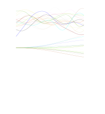

<!-- Improved compatibility of back to top link: See: https://github.com/othneildrew/Best-README-Template/pull/73 -->
<a id="readme-top"></a>
<!--
*** Thanks for checking out the Best-README-Template. If you have a suggestion
*** that would make this better, please fork the repo and create a pull request
*** or simply open an issue with the tag "enhancement".
*** Don't forget to give the project a star!
*** Thanks again! Now go create something AMAZING! :D
-->


<!-- PROJECT SHIELDS -->
<!--
*** I'm using markdown "reference style" links for readability.
*** Reference links are enclosed in brackets [ ] instead of parentheses ( ).
*** See the bottom of this document for the declaration of the reference variables
*** for contributors-url, forks-url, etc. This is an optional, concise syntax you may use.
*** https://www.markdownguide.org/basic-syntax/#reference-style-links
-->
<!--
[![Contributors][contributors-shield]][contributors-url]
[![Forks][forks-shield]][forks-url]
[![Stargazers][stars-shield]][stars-url]
[![Issues][issues-shield]][issues-url]
[![MIT License][license-shield]][license-url]
[![LinkedIn][linkedin-shield]][linkedin-url]
-->


<!-- PROJECT LOGO -->
<br />
<div align="center">
  <a href="https://github.com/JoachimSchaeffer/BattGP">
    
  </a>

<!-- <h3 align="center">project_title</h3> -->

  <p align="center">
    <!--
    project_description
    <br />
    <a href="https://github.com/JoachimSchaeffer/BattGP"><strong>Explore the docs »</strong></a>
    <br />
    <br />
    <a href="https://github.com/JoachimSchaeffer/BattGP">View Demo</a>
    ·
    -->
    <a href="https://github.com/JoachimSchaeffer/BattGP/issues/new?labels=bug&template=bug-report---.md">Report Bug</a>
    ·
    <a href="https://github.com/JoachimSchaeffer/BattGP/issues/new?labels=enhancement&template=feature-request---.md">Request Feature</a>
  </p>
</div>


<!-- TABLE OF CONTENTS -->
<details>
  <summary>Table of Contents</summary>
  <ol>
    <li>
      <a href="#about-the-project">About The Project</a>
      <ul>
        <li><a href="#built-with-love-and">Built with love and</a></li>
      </ul>
    </li>
    <li>
      <a href="#getting-started">Getting Started</a>
      <ul>
        <li><a href="#prerequisites">Prerequisites</a></li>
        <li><a href="#installation">Installation</a></li>
      </ul>
    </li>
    <li><a href="#usage">Usage</a></li>
    <li><a href="#contributing">Contributing</a></li>
    <li><a href="#license">License</a></li>
    <li><a href="#contact">Contact</a></li>
    <li><a href="#acknowledgments">Acknowledgments</a></li>
    <li><a href="#corresponding-articles">Corresponding Articles</a></li>
  </ol>
</details>


<!-- ABOUT THE PROJECT -->
## About The Project

<!-- [![Product Name Screen Shot][product-screenshot]](https://example.com) -->
BattGP: Battery systems modeling from field data using Gaussian processes.

This project contains the code corresponding to [publication [1]](https://arxiv.org/abs/2406.19015).
The manuscript contains the technical details and equations describing the Guassian Process (GP) implementation and fault probabilities.
This software was developed to analyze and model 8s1p LFP battery systems from field data.
The dataset is openly available on Zenodo: [https://zenodo.org/records/13715694](https://zenodo.org/records/13715694).
There are two main modes available:\
(1) Excat GP (`full_gp`) using a specified number of data points. Exact GPs usually scale with O(n^3). Thus, you will either be limited by memory or compute. On an NVIDIA A1000, you can use up to 40k data points.
(2) Recursive spatiotemporal (`spatio_temporal`) GPs. These GPs can use all data points and take minutes to run on a powerful Laptop computer using hundreds of thousands/millions of data points. There are approximations in the spatial domain `basis vectors`, and the computational complexity depends on the number of basis vectors.


We would like to invite others to collaborate with us on the effort of making fault detection for lithium-ion batteries from field data better, more open and more accessible.
All figure numbers mentioned below are in correspondance to this article and the supplemental information.

### Important remark: This is research software v.0.1.0.
### Despite taking care in designing this software and testing its functionality there are likely bugs remaining.

<p align="right">(<a href="#readme-top">back to top</a>)</p>


<!-- Built with love and -->
### Built with love and

* [![PyTorch][pytorch.org]][PyTorch-url]

<p align="right">(<a href="#readme-top">back to top</a>)</p>


<!-- GETTING STARTED -->
## Getting Started

### Installation

0. Clone the repo
```sh
git clone https://github.com/JoachimSchaeffer/BattGP.git
```

1. Creta a new environment using conda/miniconda. If you want to use an existing environment jump to step 3.
```sh
conda create -n "battgp" python=3.10 ipython
```

2. Activate the environment
```sh
conda activate battgp
```

3. Install dependencies
```sh
pip install -r requirements.txt
```

<p align="right">(<a href="#readme-top">back to top</a>)</p>


<!-- USAGE EXAMPLES -->
## Usage
<!--
Use this space to show useful examples of how a project can be used. Additional screenshots, code examples and demos work well in this space. You may also link to more resources.

_For more examples, please refer to the [Documentation](https://example.com)_
-->

### Download the data

First you should download the battery field data set for which this package was developed.
The data set is publicaly available on Zenodo [https://zenodo.org/records/13715694](https://zenodo.org/records/13715694).

Place the file `field_data.zip` inside the `data` folder.

If you want to use your own data, it might still make sense to familiarize yourself with how this software works by using the default data set.
More information of how to use this software with your own data can be found below.

### Data visualization

There are three scripts for data visualization:
1. To get started execute `data_vis_general.ipynb` first. The first time you run it might take a while to serialize the data.
2. `data_vis_big_timeseries.ipynb` contains the datashader code, allowing to visualize millions of timeseries data points
3. `data_vis_ridgeline_plot.py` contains the code for the ridgeline plots, a.k.a. fancy barcharts of statistics for each system in the data set.

### Modeling and plotting results

0. `tutorial_recursive_spatiotemporal_gp.py` is a short tutorial to introduce the basics of the recursive spatiotemporal GP approach we are using.
1. `example_usage_battgp.py` contains a lot of comments on how to use this software and how to get started.
2. `gp_runner.py` runs the different models for the [data set](https://zenodo.org/records/13715694) and reproduces the results of the associated manuscripts [[Cell Reports Physical Science](https://doi.org/10.1016/j.xcrp.2024.102258), [NeurIPS BDU Workshop](https://openreview.net/forum?id=18snzX2tfS)].

### Using your own data

The easiest way to use this software with your own data is to write a new BattData class that preprocesses your data.
More development is needed to allow the processing of data from larger packs with parallel strings.

<p align="right">(<a href="#readme-top">back to top</a>)</p>


<!-- Known Issues & Open Tasks

## Known Issues And Open Tasks


- [1] Pack model: Currently the pack model is not used.

- [ ] Feature 1
- [ ] Feature 2
- [ ] Feature 3
    - [ ] Nested Feature

See the [open issues](https://github.com/JoachimSchaeffer/BattGP/issues) for a full list of proposed features (and known issues).


<p align="right">(<a href="#readme-top">back to top</a>)</p>
-->

<!-- CONTRIBUTING -->
## Contributing

Contributions are what make the open source community such an amazing place to learn, inspire, and create. Any contributions you make are **greatly appreciated**.

If you have a suggestion that would make this better, please fork the repo and create a pull request. You can also simply open an issue with the tag "enhancement".
Don't forget to give the project a star! Thanks again!

1. Fork the Project
2. Create your Feature Branch (`git checkout -b feature/AmazingFeature`)
3. Commit your Changes (`git commit -m 'Add some AmazingFeature'`)
4. Push to the Branch (`git push origin feature/AmazingFeature`)
5. Open a Pull Request

<p align="right">(<a href="#readme-top">back to top</a>)</p>


<!--
### Top contributors:

<a href="https://github.com/JoachimSchaeffer/BattGP/graphs/contributors">
  
</a>
-->


<!-- LICENSE -->
## License

Distributed under the BSD 3-Clause License. See `LICENSE.txt` for more information.

<p align="right">(<a href="#readme-top">back to top</a>)</p>


<!-- CONTACT -->
## Contact

Joachim Schaeffer - joachim.schaeffer@posteo.de

BattGP Project Link: [https://github.com/JoachimSchaeffer/BattGP](https://github.com/JoachimSchaeffer/BattGP)

<p align="right">(<a href="#readme-top">back to top</a>)</p>


<!-- ACKNOWLEDGMENTS -->
## Acknowledgments

* Co-authors: Many thanks to all the co-authors involved in [1] and [2].
* Anonymous data provider: Many thanks for sharing the [data set](https://zenodo.org/records/13715694) with us. You sparked this project.
* [ReadMe Template](https://github.com/othneildrew/Best-README-Template/)

<p align="right">(<a href="#readme-top">back to top</a>)</p>

## Corresponding Articles:

If you found this software useful for your research, please cite:

[1] [Cell Reports Physical Science](https://doi.org/10.1016/j.xcrp.2024.102258):
```tex
@article{schaeffer2024_battgp,
  title = {Gaussian process-based online health monitoring and fault analysis of lithium-ion battery systems from field data},
	author = {Joachim Schaeffer and Eric Lenz and Duncan Gulla and Martin Z. Bazant and Richard D. Braatz and Rolf Findeisen},
  journal = {Cell Reports Physical Science},
	pages = {102258},
  year={2024}
  doi = {https://doi.org/10.1016/j.xcrp.2024.102258},
}
```

[2] Short version [NeurIPS workshop paper](https://openreview.net/forum?id=18snzX2tfS) highlighting open areas for future work:
```tex
@inproceedings{schaeffer2024lithium,
  title={Lithium-ion battery system health monitoring and resistance-based fault analysis from field data using recursive spatiotemporal {Gaussian} processes},
  author={Schaeffer, Joachim and Lenz, Eric and Gulla, Duncan and Bazant, Martin Z and Braatz, Richard and Findeisen, Rolf},
  booktitle={NeurIPS 2024 Workshop on Bayesian Decision-making and Uncertainty}
}
```

<p align="right">(<a href="#readme-top">back to top</a>)</p>


<!-- MARKDOWN LINKS & IMAGES -->
<!-- https://www.markdownguide.org/basic-syntax/#reference-style-links -->
[contributors-shield]: https://img.shields.io/github/contributors/JoachimSchaeffer/BattGP.svg?style=for-the-badge
[contributors-url]: https://github.com/JoachimSchaeffer/BattGP/graphs/contributors
[forks-shield]: https://img.shields.io/github/forks/JoachimSchaeffer/BattGP.svg?style=for-the-badge
[forks-url]: https://github.com/JoachimSchaeffer/BattGP/network/members
[stars-shield]: https://img.shields.io/github/stars/JoachimSchaeffer/BattGP.svg?style=for-the-badge
[stars-url]: https://github.com/JoachimSchaeffer/BattGP/stargazers
[issues-shield]: https://img.shields.io/github/issues/JoachimSchaeffer/BattGP.svg?style=for-the-badge
[issues-url]: https://github.com/JoachimSchaeffer/BattGP/issues
[license-shield]: https://img.shields.io/github/license/JoachimSchaeffer/BattGP.svg?style=for-the-badge
[license-url]: https://github.com/JoachimSchaeffer/BattGP/blob/master/LICENSE.txt
[linkedin-shield]: https://img.shields.io/badge/-LinkedIn-black.svg?style=for-the-badge&logo=linkedin&colorB=555
[linkedin-url]: https://linkedin.com/in/joachimschaeffer
[product-screenshot]: images/screenshot.png
[pytorch.org]: https://img.shields.io/badge/PyTorch-EE4C2C?style=for-the-badge&logo=pytorch&logoColor=white
[PyTorch-url]: https://pytorch.org
[Vue-url]: https://vuejs.org/
[Angular.io]: https://img.shields.io/badge/Angular-DD0031?style=for-the-badge&logo=angular&logoColor=white
[Angular-url]: https://angular.io/
[Svelte.dev]: https://img.shields.io/badge/Svelte-4A4A55?style=for-the-badge&logo=svelte&logoColor=FF3E00
[Svelte-url]: https://svelte.dev/
[Laravel.com]: https://img.shields.io/badge/Laravel-FF2D20?style=for-the-badge&logo=laravel&logoColor=white
[Laravel-url]: https://laravel.com
[Bootstrap.com]: https://img.shields.io/badge/Bootstrap-563D7C?style=for-the-badge&logo=bootstrap&logoColor=white
[Bootstrap-url]: https://getbootstrap.com
[JQuery.com]: https://img.shields.io/badge/jQuery-0769AD?style=for-the-badge&logo=jquery&logoColor=white
[JQuery-url]: https://jquery.com
